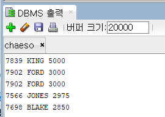

# PL/SQL_PROCEDURE

## PROCEDURE 란?

어떤 프로세스를 절차적으로 기술해놓은 것으로 사용시 재사용성이 증가된다.

기능을 미리 만들어 놓고 호출하여 사용한다는 점에서 함수와 비슷하다.

[저장프로시저와 함수의 차이](https://www.notion.so/f4a85e2f35aa4e1bb917952744aa6b62)

## 🙃 프로시저 생성

CREATE OR REPLACE 프로시저이름(변수이름 IN 데이터타입 , ...)
  IS 변수이름 데이터타입; ....
  BEGIN
         기능구현;
  END;

## 🙃 프로시저 실행

  EXECUTE 프로시저이름;
  EXEC 프로시저이름;

- 예시 1

```sql
--봉급 순으로 TOP 5 출력
create or replace procedure p_practice1
is
    v_emp emp%rowtype;
begin
    for i in 1..5 loop
        select * into v_emp from(
                select * 
                from(select * from emp where sal is not null or sal <> ' ' order by sal desc)
                    where rownum <= i order by sal asc)
                where rownum =1 order by sal asc;
        
        dbms_output.put_line(v_emp.empno || ' ' || v_emp.ename|| ' ' || v_emp.sal);
    end loop;
end;
--
execute p_practice1;
```

결과



- 예시 2

```sql
--emp 테이블 값 insert
create or replace procedure p_empinsert(
    v_empno in emp.empno%type default 8998,
    v_ename in emp.ename%type := '유채연',
    v_sal in emp.sal%type := 4500
    )
is
begin
    insert into emp(empno, ename, sal) values(v_empno, v_ename, v_sal);
    dbms_output.put_line('insert 값 : '|| v_empno || v_ename || v_sal);
end;

--실행
execute p_empinsert;
--execute p_empinsert(9009, '김가나', 4500);
```

결과


## 🙃 저장프로시저 찾기

  SELECT * FROM USER_OBJECTS
  WHERE LOWER(object_type) = 'procedure';

검색 결과


## 🙃 프로시저가 작성된 쿼리문 검색

  SELECT text FROM user_source
  WHERE LOWER(NAME) = ＇프로시져이름';

검색

```sql
select * from user_source
where lower(name) = 'p_empinsert';
```

검색 결과

