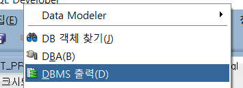

# PL/SQL

## PL/SQL(Procedural Language) 란?

오라클 사에서 SQL언어에 절차적인 프로그래밍이 가능하도록 만든 언어이다.

## PL/SQL 구조

```sql
DECLARE 선언(선택)
BEGIN
실행(필수)
END;

--예시
DECLARE NAME VARCHAR2(20) := 'CHAEYEON';
BEGIN
	DBMS_OUTPUT.PUT_LINE('HELLO' || NAME); --DBMS 출력
END;
```

- DBMS 출력 방법

Oracle SQL Developer > 보기 > DBMS 출력



## 🐳 변수 선언

- 변수 선언 방법

```sql
--DECLARE 변수이름 데이터타입;
DECLARE NAME VARCHAR2(10);
-- 값 지정
DECLARE NAME VARCHAR2(20):='CHAEYEON';
-- 기본값 지정
DECLARE NAME VARCHAR2(20) DEFAULT 'CHAEYEON';
```

- 변수 여러개 선언

```sql
DECLARE name VARCHAR2(20); age NUMBER(2); addr VARCHAR2(50);
```

- 데이터타입 종류
1. 일반

    number(), varchar2(), char(), int, date, ...

2. 테이블이름.필드명%TYPE

    DECLARE NAME emp.ename%type;

3. 테이블이름%RowType

    DECLARE DATA emp%rowtype;

- 예시

    ```sql
    DECLARE  e_name emp.ename%type;
    BEGIN
        select ename into e_name from emp where empno='7839';
        dbms_output.put_line('7788님의 이름은 ' || e_name);
    END
    ```

    

    ```sql
    DECLARE data emp%ROWTYPE;
    BEGIN
        SELECT * INTO data FROM emp where empno = '7839';
        dbms_output.put_line(data.ename || ', ' ||data.job || ', ' ||data.mgr || ', ' ||data.deptno);
    END;
    ```

    