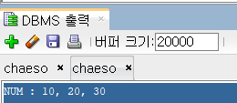

# PL/SQL_제어문

- 입력

```sql
DECLARE
	NUM NUMBER := &A_NUM;
BEGIN
	DBMS_OUTPUT.PUT_LINE('NUM : ' || NUM  || ', &A_NUM, ' || &A_NUM);
END;
```



## 🍀제어문

🙃 **IF 문**

   IF 조건식 THEN 실행문장;
   ELSIF 조건식 THEN 실행문장;
   ELSIF 조건식 THEN 실행문장;
   ....
   ELSE 실행문장;
   END IF;

- 예시 1

```sql
/* 학점계산 */
DECLARE
	kor NUMBER(3) := &AKOR;
	eng NUMBER(3) := &AENG;
	math NUMBER(3):= &AMATH;
	total NUMBER :=0;
	average NUMBER;
BEGIN
	DBMS_OUTPUT.PUT_LINE('성적 출력하기');
	--문) 90점이상이면 'A학점' 출력.
	total := kor+eng+math;
	average := total/3;
	IF average >=90 THEN
		DBMS_OUTPUT.PUT_LINE('A학점');
	ELSIF average >=80 THEN
		DBMS_OUTPUT.PUT_LINE('B학점');
	ELSIF average >=70 THEN
		DBMS_OUTPUT.PUT_LINE('C학점');
	ELSIF average >=60 THEN
		DBMS_OUTPUT.PUT_LINE('D학점');
	ELSE
		DBMS_OUTPUT.PUT_LINE('F학점');
	END IF;
	DBMS_OUTPUT.PUT_LINE('평균:' || round(average, 0));

END;
```

결과 (INPUT : 90, 100, 100)


- 예시 2

```sql
/*
	문)입력받은 숫자가 '3과 5의 공배수'인지
           아니면 '3의 배수'인지
                 '5의 배수'인지
                 '3과 5의 배수가 아니다'를
           출력하여라
	*/
DECLARE NUM NUMBER := &ANUM;
BEGIN
	IF MOD(NUM,15) = 0 THEN
		DBMS_OUTPUT.PUT_LINE('3과 5의 공배수');
	ELSIF MOD(NUM,3) = 0 THEN
		DBMS_OUTPUT.PUT_LINE('3의 배수');
	ELSIF MOD(NUM,5) = 0 THEN
		DBMS_OUTPUT.PUT_LINE('5의 배수');
	ELSE
		DBMS_OUTPUT.PUT_LINE('3과 5의 배수가 아니다');
	END IF;

END;
```

결과 (INPUT : 9)


🙃 **FOR 문 & LOOP 문**

  FOR 변수이름 IN 시작 .. 끝 loop
  실행문장;
  END LOOP;

  LOOP
  실행문장;
  증감식;
  EXIT [ WHEN 조건식] ; --조건식이 만족할 때 loop을 빠져나간다.
  END loop;

- FOR 예시 1

```sql
/* 1부터 10까지 합 */
DECLARE 
	SUM1 NUMBER :=0;
    NUM1 NUMBER := 1;
    NUM2 NUMBER := 10;
BEGIN
	FOR I IN NUM1 .. NUM2 LOOP
		IF MOD(I,2)=0 THEN
			SUM1 := SUM1 + I;
		END IF;
	END LOOP;
	DBMS_OUTPUT.PUT_LINE( NUM1 ||'부터 ' || NUM2 || '까지 짝수의 합:' || SUM1);
END;
```

결과


- LOOP 예시 1

```sql
--시작값부터 종료값까지의 누적합
DECLARE
	HAP NUMBER := 0;
	SM NUMBER := &SNUM;
  LM NUMBER := &LNUM;
  SM1 NUMBER := SM;
BEGIN
	HAP := 0;
	LOOP
		HAP := HAP+ SM1;
		SM1 := SM1+1;
		EXIT WHEN LM < SM1;
	END LOOP;
	DBMS_OUTPUT.PUT_LINE( SM || '부터 ' || LM || '까지 누적합:' || HAP);
END;
```

결과 (INPUT : 1, 30)


**🙃 While 문**

  WHILE 조건식 LOOP
    실행문장;
    증감식;
  END LOOP;

- 예시 1

```sql
--1~10까지 합
DECLARE
	SUM1 NUMBER DEFAULT 0;
	I NUMBER :=1;
BEGIN
	WHILE I <=10 LOOP
		SUM1 := SUM1+I;
		I := I+1;
	END LOOP;
	DBMS_OUTPUT.PUT_LINE('1부터 10까지 누적합:' || SUM1);
END;
```

결과


- 예시 2

```sql
/*
	1 0 0 0
	0 1 0 0
	0 0 1 0
	0 0 0 1 찍기
	*/
DECLARE 
    I NUMBER := 0;
    J NUMBER := 0;
BEGIN
    WHILE I<4 LOOP
        WHILE J<4 LOOP
            IF I=J THEN 
                DBMS_OUTPUT.PUT('1 ');
            ELSE DBMS_OUTPUT.PUT('0 ');
            END IF;
            J := J +1;
        END LOOP;
        DBMS_OUTPUT.NEW_LINE;
        I := I + 1;
        J := 0;
    END LOOP;
END;
```

결과

